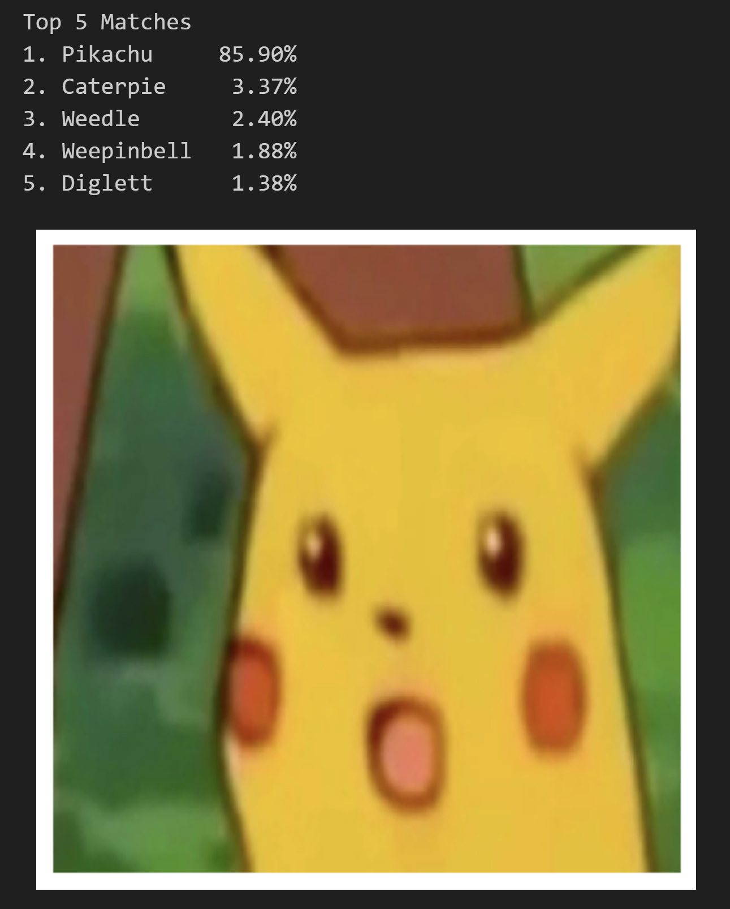

# Computer Vision Pokédex

We trained a convolutional neural network (CNN) to classify images of Pokémon from Generation 1. We experimented with various archietectures and hyperparameters, and used transfer learning to produce our final model. The model achieves an accuracy of 84.0% and a top-5 accuracy of 94.4%.

The dataset used was a combination of a dataset from [Kaggle](https://www.kaggle.com/datasets/lantian773030/pokemonclassification/) as well as images collected from the [Pokémon Fandom Wikia website](https://pokemon.fandom.com/wiki/List_of_Generation_I_Pokémon). The final dataset comprised of 13965 images from a variety of media, such as the mainline games, the anime, spinoff games, fanart, etc.

## Try it Yourself!

If you'd like to play around with our final model yourself, simply clone this repo and open up [test.ipynb](test.ipynb). Ensure that you have all the necessary Python libraries including Tensorflow and Keras installed. Add a filepath to an image you'd like to use in the last cell of the notebook and run the code to see what our model classifies your image as!

## Acknowledgements

This project was done by group Quack Propagation 🦆, consisting of:

* [Tze Kin Tai](https://github.com/teekaytai)
* [Astrid Bina Utami](https://github.com/annacecilia-75)
* [Sue Ning Wee](https://github.com/vee-wsn)
* [Oliver Burger](https://github.com/OLILOB)
* [Justin Zhang](https://github.com/Justin6940)

We would also like to thank our project mentor Maryam Hashemi for her guidance and support.